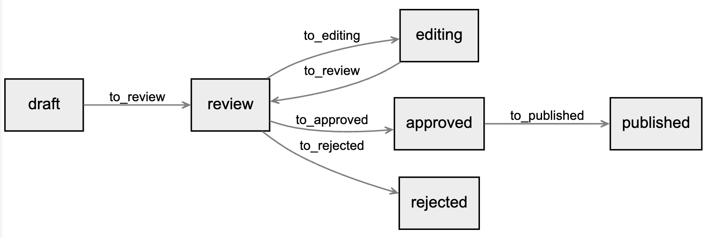

# State Machine

PHP [State Machine](https://en.wikipedia.org/wiki/Finite-state_machine).

Control transition of your entity from one state to another.

```php
$stateDraft = new State('draft');
$stateReview = new State('review');
$stateApproved = new State('approved');
$stateRejected = new State('rejected');
$stateEditing = new State('editing');
$statePublished = new State('published');

$transitionToReview = new Transition('to_review', [$stateDraft, $stateEditing], $stateReview);
$transitionToApproved = new Transition('to_approved', [$stateReview], $stateApproved);
$transitionToRejected = new Transition('to_rejected', [$stateReview], $stateRejected);
$transitionToEditing = new Transition('to_editing', [$stateReview], $stateEditing);
$transitionToPublished = new Transition('to_published', [$stateApproved], $statePublished);

class Post {
    public $state = 'draft';
}

$stateMachine = new StateMachine(
    function (Post $post) {
        return new State($post->state);
    },
    function (Post $post, StateInterface $newState) {
        $post->state = $newState->getName();
    }
);

$stateMachine->addTransitions([
    $transitionToReview,
    $transitionToApproved,
    $transitionToRejected,
    $transitionToEditing,
    $transitionToPublished,
]);

$post = new Post();

$stateMachine->transition('to_review', $post); // Ok
$stateMachine->transition('to_published', $post); // NoSuitableTransitionException
```

